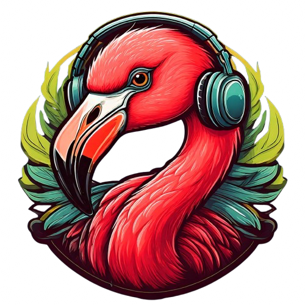
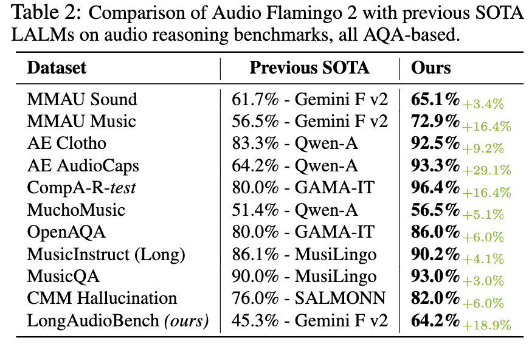
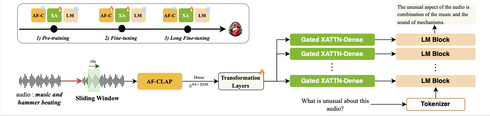

<div align="center">
   
  <h1> Audio Flamingo 2<br/> 
    <span style="font-size: 0.6em;">
      An Audio-Language Model with Long-Audio Understanding and Expert Reasoning Abilities
    </span>
  </h1>
</div>

**Sreyan Ghosh, Zhifeng Kong, Sonal Kumar, S Sakshi, Jaehyeon Kim, Wei Ping, Rafael Valle, Dinesh Manocha, Bryan Catanzaro**

## Links

[[paper]](https://arxiv.org/abs/2503.03983) [[Demo website]](https://research.nvidia.com/labs/adlr/AF2/)

#### Audio Flamingo 2 - 0.5B: [[Gradio]](https://huggingface.co/spaces/nvidia/audio-flamingo-2-0.5B) [[Checkpoints]](https://huggingface.co/nvidia/audio-flamingo-2-0.5B)

#### Audio Flamingo 2 - 1.5B: [[Gradio]](https://huggingface.co/spaces/nvidia/audio-flamingo-2-1.5B) [[Checkpoints]](https://huggingface.co/nvidia/audio-flamingo-2-1.5B)

#### Audio Flamingo 2 - 3B: [[Gradio]](https://huggingface.co/spaces/nvidia/audio-flamingo-2) [[Checkpoints]](https://huggingface.co/nvidia/audio-flamingo-2-3B)

## Overview

This repo contains the PyTorch implementation of [Audio Flamingo 2: An Audio-Language Model with Long-Audio Understanding and Expert Reasoning Abilities](). Audio Flamingo 2 achieves the state-of-the-art performance across over 20 benchmarks, with only a 3B parameter small language model. It is improved from our previous [Audio Flamingo](https://arxiv.org/abs/2402.01831). 

- We introduce two datasets, AudioSkills for expert audio reasoning, and LongAudio for long audio understanding, to advance the field of audio understanding.

- Audio Flamingo 2 has advanced audio understanding and reasoning capabilities. Especially, Audio Flamingo 2 has expert audio reasoning abilities, and can understand long audio up to 5 minutes.

- Audio Flamingo 2 outperforms larger and proprietary LALMs across 20+ benchmarks, despite being smaller (3B) and trained exclusively on public datasets.

## Main Results

Audio Flamingo 2 outperforms prior SOTA models including GAMA, Audio Flamingo, Qwen-Audio, Qwen2-Audio, LTU, LTU-AS, SALMONN, AudioGPT, Gemini Flash v2, Gemini Pro v1.5, and GPT-4o-audio on a number of understanding and reasoning benchmarks.

<div align="center">
  
</div>

<div align="center">
  
</div>

## Audio Flamingo 2 Architecture

Audio Flamingo 2 uses a cross-attention architecture similar to [Audio Flamingo](https://arxiv.org/abs/2402.01831) and [Flamingo](https://arxiv.org/abs/2204.14198). Audio Flamingo 2 can take up to 5 minutes of audio inputs. 

<div align="center">
  
</div>


## Code Structure

- The folder ```inference/``` contains inference code of Audio Flamingo 2.

The structure is highly based on the [Open Flamingo](https://github.com/mlfoundations/open_flamingo) repo (commit ```a05dcba```).

<!-- Within each folder, the structure is highly based on the [Open Flamingo](https://github.com/mlfoundations/open_flamingo) repo (commit ```a05dcba```). Each folder is self-contained and we expect no cross dependencies between these folders. -->

## References

<!-- The main training and inferencing code within each folder (```foundation/```, ```chat/```, ```inference/```), including ```train/```, ```src/```, ```data/```, and ```configs/```,  -->
The code under ```src/``` and ```configs/``` are modified from [Open Flamingo](https://github.com/mlfoundations/open_flamingo) (commit ```a05dcba```) (MIT license), which borrows from [flamingo-pytorch](https://github.com/lucidrains/flamingo-pytorch) (MIT license), [flamingo-mini](https://github.com/dhansmair/flamingo-mini) (MIT license), and [open_clip](https://github.com/mlfoundations/open_clip) (MIT license). ```src/helpers.py``` also includes self-attention implementations based on [attention-is-all-you-need-pytorch](https://github.com/jadore801120/attention-is-all-you-need-pytorch) (MIT license), which borrows from [OpenNMT-py](https://github.com/OpenNMT/OpenNMT-py) (MIT license). ```my_laion_clap``` is adapted from [LAION-AI/CLAP](https://github.com/LAION-AI/CLAP) (CC0-1.0 license).

## License

- The code in this repo is under MIT license.
- The checkpoints are for non-commercial use only (see NVIDIA OneWay Noncommercial License). They are also subject to the [Qwen Research license](https://huggingface.co/Qwen/Qwen2.5-3B/blob/main/LICENSE), the [Terms of Use](https://openai.com/policies/terms-of-use) of the data generated by OpenAI, and the original licenses accompanying each training dataset.
- Notice: Audio Flamingo 2 is built with Qwen-2.5. Qwen is licensed under the Qwen RESEARCH LICENSE AGREEMENT, Copyright (c) Alibaba Cloud. All Rights Reserved.


## Citation

- Audio Flamingo
```
@inproceedings{kong2024audio,
  title={Audio Flamingo: A Novel Audio Language Model with Few-Shot Learning and Dialogue Abilities},
  author={Kong, Zhifeng and Goel, Arushi and Badlani, Rohan and Ping, Wei and Valle, Rafael and Catanzaro, Bryan},
  booktitle={International Conference on Machine Learning},
  pages={25125--25148},
  year={2024},
  organization={PMLR}
}
```

- Audio Flamingo 2
```
@article{ghosh2025audio,
  title={Audio Flamingo 2: An Audio-Language Model with Long-Audio Understanding and Expert Reasoning Abilities},
  author={Ghosh, Sreyan and Kong, Zhifeng and Kumar, Sonal and Sakshi, S and Kim, Jaehyeon and Ping, Wei and Valle, Rafael and Manocha, Dinesh and Catanzaro, Bryan},
  journal={arXiv preprint arXiv:2503.03983},
  year={2025}
}
```