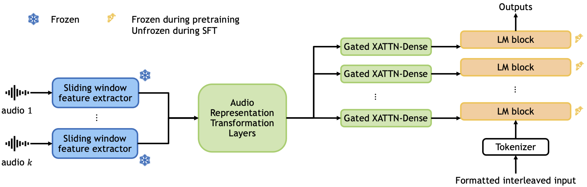

# PyTorch Implementation of Audio Flamingo

**Zhifeng Kong, Arushi Goel, Rohan Badlani, Wei Ping, Rafael Valle, Bryan Catanzaro**

[[Demo website]](https://audioflamingo.github.io/) [[Demo video]](https://www.youtube.com/watch?v=ucttuS28RVE) [[ICML poster]](assets/AudioFlamingo_ICML2024_poster.pdf)

This repo contains the PyTorch implementation of [Audio Flamingo: A Novel Audio Language Model with Few-Shot Learning and Dialogue Abilities](https://arxiv.org/abs/2402.01831) (ICML 2024). Audio Flamingo is a novel audio-understanding language model with 
- strong audio understanding abilities,
- the ability to quickly adapt to unseen tasks via in-context learning and retrieval, and 
- strong multi-turn dialogue abilities. 

We introduce a series of training techniques, architecture design, and data strategies to enhance our model with these abilities. Extensive evaluations across various audio understanding tasks confirm the efficacy of our method, setting new state-of-the-art benchmarks. 



## Code Structure

- The folder ```foundation/``` contains training code for the foundation model. 
- The folder ```chat/``` contains training code for the chat model, which can perform multi-turn dialogues. 
- The folder ```inference/``` contains inference code for both the foundation and chat models.

Within each folder, the structure is highly based on the [Open Flamingo](https://github.com/mlfoundations/open_flamingo) repo (commit ```a05dcba```). Each folder is self-contained and we expect no cross dependencies between these folders.

## Preparation

- Download source code of Laion-CLAP from their [official repo](https://github.com/LAION-AI/CLAP). Rename the folder to ```my_laion_clap/``` and copy the folder to under each of ```foundation/, chat/, inference/```. Download their pretrained checkpoints to ```YOUR_DATA_ROOT_DIR/audio-flamingo-data/laion-clap-pretrained/laion_clap/```. 
- Download source code of Microsoft-CLAP from their [official repo](https://github.com/microsoft/CLAP). Rename the folder to ```my_ms_clap/``` and copy the folder to under each of ```foundation/, chat/, inference/```. In each of these, replace the ```my_ms_clap/msclap/CLAPWrapper.py``` with ```clap_modified_code/CLAPWrapper.py```, which adds some processing functions and removes some bugs for clapcap. Download their pretrained checkpoints to ```YOUR_DATA_ROOT_DIR/audio-flamingo-data/clap/```. 
- Download raw training and evaluation datasets from their original sources. Refer to ```foundation/data/README.md``` and ```chat/data/README.md``` for specific instructions to prepare data.

## Running the Code

We refer to ```foundation/README.md```, ```chat/README.md```, and ```inference/README.md``` for the specific instructions for training the foundation model, training the chat model, and inferencing, as they require different setups. We used 8 A100 GPUs to train our models.

## Checkpoints
- The folder ```checkpoints/``` contains foundation and chat model checkpoints. 
- Each model is about 17GB. Due to ```git lfs``` constraints we split each model into 5 parts. After downloading, go to ```checkpoints/``` and ```python checkpoint_utils.py``` to merge the parts. 
- Alternatively, the model checkpoints are also on HuggingFace (which is easier to download): [https://huggingface.co/nvidia/audio-flamingo](https://huggingface.co/nvidia/audio-flamingo). One can either ```git clone``` this project or use the ```huggingface_hub.hf_hub_download``` function to download: ```checkpoint_path = hf_hub_download(repo_id="nvidia/audio-flamingo", filename="foundation(or chat).pt")```.
- If you would like to run inference with these checkpoints, remember to modify the absolute paths in ```inference/configs/*.yaml``` and ```inference/inference_examples.py``` to properly load model checkpoints and data (see ```inference/README.md```).
- The foundation model is pretrained with ```foundation/configs/foundation_pretrain.yaml``` and then finetuned with ```foundation/configs/foundation_sft_8_shot.yaml```. 
- The chat model is pretrained with ```foundation/configs/foundation_pretrain.yaml```, then finetuned with ```foundation/configs/foundation_sft_4_shot.yaml```, and finally finetuned with ```chat/configs/chat.yaml```.


## Downstream applications
- We use Audio Flamingo as a data labeling machine for synthetic captions. See ```labeling_machine/``` for details of the synthetic dataset and license descriptions.

## References

The main training and inferencing code within each folder (```foundation/```, ```chat/```, ```inference/```), including ```train/```, ```src/```, ```data/```, and ```configs/```, are modified from [Open Flamingo](https://github.com/mlfoundations/open_flamingo) (commit ```a05dcba```) (MIT license), which borrows from [flamingo-pytorch](https://github.com/lucidrains/flamingo-pytorch) (MIT license), [flamingo-mini](https://github.com/dhansmair/flamingo-mini) (MIT license), and [open_clip](https://github.com/mlfoundations/open_clip) (MIT license). ```src/helpers.py``` also includes self-attention implementations based on [attention-is-all-you-need-pytorch](https://github.com/jadore801120/attention-is-all-you-need-pytorch) (MIT license), which borrows from [OpenNMT-py](https://github.com/OpenNMT/OpenNMT-py) (MIT license). Our code also relies on [LAION-AI/CLAP](https://github.com/LAION-AI/CLAP) (CC0-1.0 license) and [microsoft/CLAP](https://github.com/microsoft/CLAP) (MIT license). In ```chat/data/prepare_each_dataset.py```, the filtering keywords are based on the [LLARK](https://arxiv.org/abs/2310.07160) paper (CC-BY-4.0 license) and the [LTU](https://arxiv.org/abs/2305.10790) paper (CC-BY-4.0 license).

## License

- The code in this repo is under MIT license (see ```LICENSE```). 
- The checkpoints in this repo (```checkpoints/*.pt```) are for non-commercial use only. They are subject to the [OPT-IML](https://huggingface.co/facebook/opt-iml-1.3b/blob/main/LICENSE.md) license, the [Terms of Use](https://openai.com/policies/terms-of-use) of the data generated by OpenAI, and the original licenses accompanying each training dataset. 


## Citation
```
@article{kong2024audio,
  title={Audio Flamingo: A Novel Audio Language Model with Few-Shot Learning and Dialogue Abilities},
  author={Kong, Zhifeng and Goel, Arushi and Badlani, Rohan and Ping, Wei and Valle, Rafael and Catanzaro, Bryan},
  journal={arXiv preprint arXiv:2402.01831},
  year={2024}
}
```
