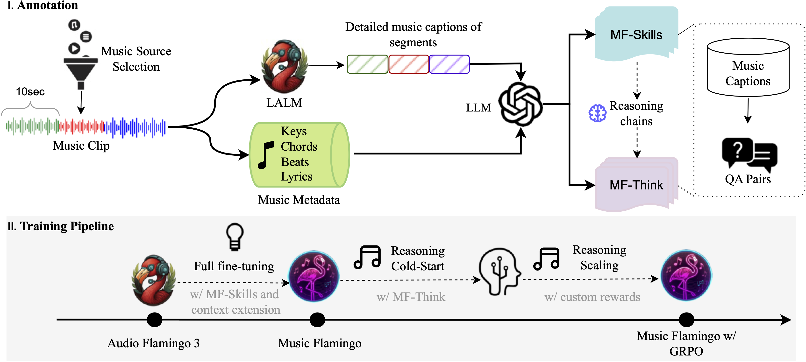

<div align="center" style="display: flex; justify-content: center; align-items: center; text-align: center;">
  <a href="https://github.com/NVIDIA/audio-flamingo" style="margin-right: 20px; text-decoration: none; display: flex; align-items: center;">
    
  </a>
</div>
<div align="center" style="display: flex; justify-content: center; align-items: center; text-align: center;">
    <h2>
    Music Flamingo: Scaling Music Understaning in Audio Language Models
    </h2>
</div>

<div align="center" style="display: flex; justify-content: center; margin-top: 10px;">
  <a href="https://arxiv.org/abs/2511.10289"></a>
  <a href="https://research.nvidia.com/labs/adlr/MF/"></a>
  <a href="https://github.com/NVIDIA/audio-flamingo"></a>
  <a href="https://github.com/NVIDIA/audio-flamingo/stargazers"></a>
</div>

<div align="center" style="display: flex; justify-content: center; margin-top: 10px; flex-wrap: wrap; gap: 5px;">
  <a href="https://huggingface.co/nvidia/music-flamingo">
    
  </a>
  <a href="https://huggingface.co/datasets/nvidia/MF-Skills">
    
  </a>
</div>

<div align="center" style="display: flex; justify-content: center; margin-top: 10px;">
<a href="https://huggingface.co/spaces/nvidia/music-flamingo"></a>
</div>

🚨 **Note:** This is a *preview* model. We will release a better base and a thinking version of the model in the next few weeks. 

## Description:
Music Flamingo (MF) is a fully open, state-of-the-art Large Audio-Language Model (LALM) designed to advance music (including song) understanding in foundational audio models. MF brings together innovations in:

- Deep music understanding across songs and instrumentals.
- Rich, theory-aware captions and question answering (harmony, structure, timbre, lyrics, cultural context).
- Reasoning-centric training using chain-of-thought + reinforcement learning with custom rewards for step-by-step reasoning.
- Long-form song reasoning over full-length, multicultural audio (extended context).

Extensive evaluations confirm Music Flamingo's effectiveness, setting new benchmarks on over 10+ public music understanding and reasoning tasks.

**This model is for non-commercial research purposes only.**


<center></center>

## Usage

Music Flamingo (MF) is supported in 🤗 Transformers. To run the model, first install Transformers:

```bash
pip install --upgrade pip
pip install --upgrade git+https://github.com/huggingface/transformers accelerate
```

> **Note:** MF processes audio in 30-second windows with a **10-minute** total cap per sample. Longer inputs are truncated.

### Single-turn: audio + text instruction

```python
from transformers import AudioFlamingo3ForConditionalGeneration, AutoProcessor

model_id = "nvidia/music-flamingo-hf"
processor = AutoProcessor.from_pretrained(model_id)
model = AudioFlamingo3ForConditionalGeneration.from_pretrained(model_id, device_map="auto")

conversation = [
    {
        "role": "user",
        "content": [
            {"type": "text", "text": "Describe this track in full detail - tell me the genre, tempo, and key, then dive into the instruments, production style, and overall mood it creates."},
            {"type": "audio", "path": "https://huggingface.co/datasets/nvidia/MF-Skills/resolve/main/assets/song_1.mp3"},
        ],
    }
]

inputs = processor.apply_chat_template(
    conversation,
    tokenize=True,
    add_generation_prompt=True,
    return_dict=True,
).to(model.device)

outputs = model.generate(**inputs, max_new_tokens=1024)

decoded_outputs = processor.batch_decode(outputs[:, inputs.input_ids.shape[1]:], skip_special_tokens=True)
print(decoded_outputs)
```

### Batch multiple conversations

```python
from transformers import AudioFlamingo3ForConditionalGeneration, AutoProcessor

model_id = "nvidia/music-flamingo-hf"
processor = AutoProcessor.from_pretrained(model_id)
model = AudioFlamingo3ForConditionalGeneration.from_pretrained(model_id, device_map="auto")

conversations = [
    [
        {
            "role": "user",
            "content": [
                {
                    "type": "text",
                    "text": "Describe this track in full detail - tell me the genre, tempo, and key, then dive into the instruments, production style, and overall mood it creates."},
                {
                    "type": "audio",
                    "path": "https://huggingface.co/datasets/nvidia/MF-Skills/resolve/main/assets/song_1.mp3",
                },
            ],
        }
    ],
    [
        {
            "role": "user",
            "content": [
                {
                    "type": "text",
                    "text": "Write a rich caption that blends the technical details (genre, BPM, key, chords, mix) with how the song feels emotionally and dynamically as it unfolds.",
                },
                {
                    "type": "audio",
                    "path": "https://huggingface.co/datasets/nvidia/MF-Skills/resolve/main/assets/song_2.mp3"
                },
            ],
        }
    ],
]

inputs = processor.apply_chat_template(
    conversations,
    tokenize=True,
    add_generation_prompt=True,
    return_dict=True,
).to(model.device)

outputs = model.generate(**inputs, max_new_tokens=1024)

decoded_outputs = processor.batch_decode(outputs[:, inputs.input_ids.shape[1]:], skip_special_tokens=True)
print(decoded_outputs)
```

### Text-only and audio-only prompts

```python
# text-only
conv = [{"role": "user", "content": [{"type": "text", "text": "What is the capital of France?"}]}]
batch = processor.apply_chat_template(conv, tokenize=True, add_generation_prompt=True, return_dict=True).to(device)
print(processor.batch_decode(model.generate(**batch)[:, batch["input_ids"].shape[1]:], skip_special_tokens=True)[0])

# audio-only
conv = [{"role": "user", "content": [{"type": "audio", "path": "https://.../sample.wav"}]}]
batch = processor.apply_chat_template(conv, tokenize=True, add_generation_prompt=True, return_dict=True).to(device)
print(processor.batch_decode(model.generate(**batch)[:, batch["input_ids"].shape[1]:], skip_special_tokens=True)[0])
```

### Training / Fine-tuning

```python
from transformers import AudioFlamingo3ForConditionalGeneration, AutoProcessor

model_id = "nvidia/music-flamingo-hf"
processor = AutoProcessor.from_pretrained(model_id)
model = AudioFlamingo3ForConditionalGeneration.from_pretrained(model_id, device_map="auto")
model.train()

conversation = [
    [
        {
            "role": "user",
            "content": [
                {"type": "text", "text": "What's the key of this song?"},
                {"type": "audio", "path": "https://huggingface.co/datasets/nvidia/MF-Skills/resolve/main/assets/song_1.mp3"},
            ],
        },
        {
            "role": "assistant",
            "content": [{"type": "text", "text": "D major"}],
        }
    ],
    [
        {
            "role": "user",
            "content": [
                {
                    "type": "text",
                    "text": "What's the bpm of this song?",
                },
                {"type": "audio", "path": "https://huggingface.co/datasets/nvidia/MF-Skills/resolve/main/assets/song_2.mp3"},
            ],
        },
        {
            "role": "assistant",
            "content": [{"type": "text", "text": "87"}],
        }

    ]
]

inputs = processor.apply_chat_template(
    conversation,
    tokenize=True,
    add_generation_prompt=True,
    return_dict=True,
    output_labels=True,
).to(model.device)

loss = model(**inputs).loss
loss.backward()
```

### Generation options

You can tune decoding similar to other text-generation models:

```python
generate_kwargs = {
    "max_new_tokens": 256,
    "do_sample": True,
    "temperature": 0.7,
    "top_p": 0.9,
}
out = model.generate(**batch, **generate_kwargs)
```

## Additional Speed & Memory Improvements

### Flash Attention 2

If your GPU supports it and you are **not** using `torch.compile`, install Flash-Attention and enable it at load time:

```bash
pip install flash-attn --no-build-isolation
```

```python
model = AudioFlamingo3ForConditionalGeneration.from_pretrained(
    model_id, torch_dtype=torch_dtype, low_cpu_mem_usage=True, attn_implementation="flash_attention_2"
).to(device)
```

### Torch compile

MF’s forward pass is compatible with `torch.compile` for significant speed-ups:

```python
import torch
torch.set_float32_matmul_precision("high")

model.generation_config.cache_implementation = "static"
model.generation_config.max_new_tokens = 256
model.forward = torch.compile(model.forward, mode="reduce-overhead", fullgraph=True)
```

> `torch.compile` is not compatible with Flash Attention 2 at the same time.

### PyTorch SDPA

If Flash-Attention isn’t available, MF will use PyTorch scaled-dot product attention (SDPA) by default on supported PyTorch versions. You can set it explicitly:

```python
model = AudioFlamingo3ForConditionalGeneration.from_pretrained(
    model_id, torch_dtype=torch_dtype, low_cpu_mem_usage=True, attn_implementation="sdpa"
).to(device)
```

## License / Terms of Use
The model is released under the NVIDIA OneWay Noncommercial License. Portions of the dataset generation are also subject to the [Qwen Research License](https://huggingface.co/Qwen/Qwen2.5-3B/blob/main/LICENSE) and OpenAI’s [Terms of Use](https://openai.com/policies/terms-of-use).

## Deployment Geography
Global.

## Use Case
Intended for researchers and developers to explore:
- Music question answering and reasoning  
- Long-context music comprehension  
- Interactive music design assistants  

## References:
* [Music Flamingo: Scaling Music
Understanding in Audio Language Models](https://research.nvidia.com/labs/adlr/MF/)  
* [Project Page](https://github.com/NVIDIA/audio-flamingo)  
* [Demo Website](https://musicflamingo-nv-umd.github.io/)

## Model Architecture:
**Architecture Type:** Transformer   
**Network Architecture:** [Audio Flamingo 3](https://github.com/NVIDIA/audio-flamingo/tree/audio_flamingo_3)
**Number of model parameters:** 8B

MF uses:
- AF-Whisper unified audio encoder from Audio Flamingo 3
- MLP-based audio adaptor  
- Decoder-only LLM backbone (Qwen2.5-7B)  

**This model was developed based on [Audio Flamingo 3](https://github.com/NVIDIA/audio-flamingo/tree/audio_flamingo_3)**


## Input: 
Input Type: Music (song or instrumental), Text <br>
Input Format: WAV/MP3/FLAC, UTF-8 text <br>
Input Parameters: Audio is Two-Dimensional (2D) and Text is One-Dimensional (1D)<br>
Other Properties Related to Input: <br>
-Max Audio Length: 20 Minutes <br>
-Max Text Length: 24000 tokens<br>


## Output: 
Output Type: Text (and optional speech) <br>
Text Format: UTF-8 string  <br>
Output Parameters: One-Dimensional (1D)<br>
Other Properties Related to Output: <br>
-Max Text Length: 2048 tokens <br>


Our AI models are designed and/or optimized to run on NVIDIA GPU-accelerated systems (A100/H100). By leveraging NVIDIA’s hardware (e.g. GPU cores) and software frameworks (e.g., CUDA libraries), the model achieves faster training and inference times compared to CPU-only solutions. <br> 

## Software Integration:
**Runtime Engine:** PyTorch / HuggingFace Transformers  

**Supported Hardware:**  
* NVIDIA Ampere (A100)  
* NVIDIA Hopper (H100)  

**Supported OS:**  
* Linux  

The integration of foundation and fine-tuned models into AI systems requires additional testing using use-case-specific data to ensure safe and effective deployment. Following the V-model methodology, iterative testing and validation at both unit and system levels are essential to mitigate risks, meet technical and functional requirements, and ensure compliance with safety and ethical standards before deployment.

## Model Version:
* v1.0  

---

## Training and Testing Datasets:

### Training Dataset:
MF is trained entirely on music data collected from various sources. For each dataset, we mention whether the dataset annotations are collected by Human or they are Automated i.e. generated using AI models.

**Data Modality:** Audio
**Audio Training Data Size:** 10,000 to 1 Million Hours

The data collection method noted below applies for all datasets used for training and testing:<br>
Data Collection Method: Human <br>
Labeling Collection Method: Please see below.

* [LP-MusicCaps](https://github.com/seungheondoh/lp-music-caps)  (Automated)
* [MusicQA](https://github.com/shansongliu/MU-LLaMA?tab=readme-ov-file)  (Automated)
* [MusicAVQA](https://gewu-lab.github.io/MUSIC-AVQA/)  (Human)
* [MusicBench](https://huggingface.co/datasets/amaai-lab/MusicBench)  (Automated)
* [Mu-LLAMA](https://github.com/shansongliu/MU-LLaMA)  (Automated)
* [NSynth](https://magenta.tensorflow.org/datasets/nsynth)  (Human)
* [FMA](https://github.com/mdeff/fma)  (Human)
* [MusDB-HQ](https://zenodo.org/records/3338373)  (Human)
* [Music4All](https://sites.google.com/view/contact4music4all)  (Human)
* [Million Song Dataset](http://millionsongdataset.com/)  (Human)
* [MF-Skills (ours)](https://huggingface.co/nvidia/music-flamingo) (Automated)
* [MF-Think (ours)](https://huggingface.co/nvidia/music-flamingo) (Automated)

---

### Testing Dataset:
Music Flamingo is evaluated on the test split of the following datasets.

Data Collection Method: Human (for all datasets noted below) <br>
Labeling Method: Please see below.

* [MusicAVQA](https://gewu-lab.github.io/MUSIC-AVQA/)  (Human)
* [NSynth](https://magenta.tensorflow.org/datasets/nsynth)  (Human)
* [GTZAN](https://www.tensorflow.org/datasets/catalog/gtzan)  (Human)
* [MMAU-pro](https://sonalkum.github.io/mmau-pro/)  (Human)
* [MMAU](https://github.com/Sakshi113/mmau/tree/main)  (Human)
* [MMAR](https://arxiv.org/abs/2505.13032)  (Human)
* [MuchoMusic](https://huggingface.co/datasets/yongyizang/RUListening)  (Automated)
* [MusicInstruct](https://huggingface.co/datasets/m-a-p/Music-Instruct)  (Automated)
* [MusicQA](https://huggingface.co/datasets/mu-llama/MusicQA)  (Automated)
* [SongCaps (ours)](https://huggingface.co/nvidia/music-flamingo)  (Automated) 

---

## Inference:

**Engine:** HuggingFace Transformers  
**Test Hardware:** NVIDIA A100 80 GB  

---

## Ethical Considerations:
NVIDIA believes Trustworthy AI is a shared responsibility and we have established policies and practices to enable development for a wide array of AI applications.  When downloaded or used in accordance with our terms of service, developers should work with their internal model team to ensure this model meets requirements for the relevant industry and use case and addresses unforeseen product misuse.
Please report model quality, risk, security vulnerabilities or NVIDIA AI Concerns [here](https://app.intigriti.com/programs/nvidia/nvidiavdp/detail).

---

## Acknowledgements
Built with Audio Flamingo 3, Qwen, NVILA and the open audio-ML community.