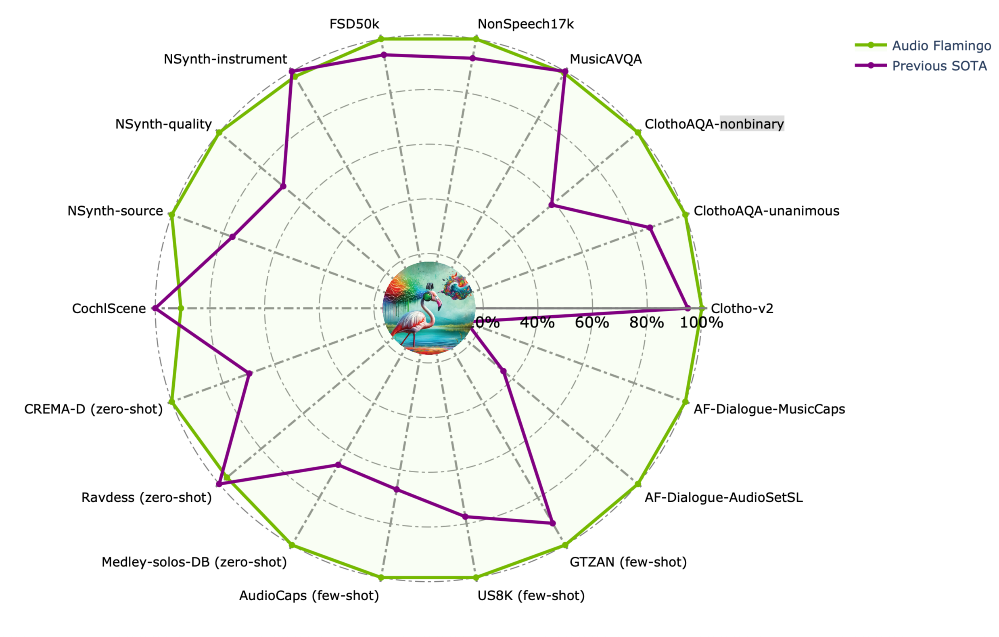

<div align="center" style="display: flex; justify-content: center; align-items: center; text-align: center;">
  <a href="https://github.com/NVIDIA/audio-flamingo" style="margin-right: 20px; text-decoration: none; display: flex; align-items: center;">
    
  </a>
</div>
<div align="center" style="display: flex; justify-content: center; align-items: center; text-align: center;">
    <h2>
    Audio Flamingo: Series of Advanced Audio Understanding Language Models
    </h2>
</div>

## Overview
In this repo, we present the **Audio Flamingo** series of advanced audio understanding Language models:
- [Audio Flamingo: A Novel Audio Language Model with Few-Shot Learning and Dialogue Abilities](https://arxiv.org/abs/2402.01831) (ICML 2024)
- [Audio Flamingo 2: An Audio-Language Model with Long-Audio Understanding and Expert Reasoning Abilities](https://arxiv.org/abs/2503.03983) (ICML 2025)
- [Audio Flamingo 3: Advancing Audio Intelligence with Fully Open Large Audio Language Models](https://arxiv.org/abs/2507.08128) (NeurIPS 2025, Spotlight)
- [Music Flamingo: Scaling Music Understaning in Audio Language Models]() (arxiv)

## Music Flamingo (arXiv)

<div align="center" style="display: flex; justify-content: center; margin-top: 10px;">
  <a href="https://arxiv.org/abs/2511.10289"></a>
  <a href="https://research.nvidia.com/labs/adlr/MF/"></a>
  <a href="https://github.com/NVIDIA/audio-flamingo/tree/music_flamingo"></a>
  <a href="https://github.com/NVIDIA/audio-flamingo/stargazers"></a>
</div>

<div align="center" style="display: flex; justify-content: center; margin-top: 10px; flex-wrap: wrap; gap: 5px;">
  <a href="https://huggingface.co/nvidia/music-flamingo">
    
  </a>
  <a href="https://huggingface.co/datasets/nvidia/MF-Skills">
    
  </a>
</div>

<div align="center" style="display: flex; justify-content: center; margin-top: 10px;">
<a href="https://huggingface.co/spaces/nvidia/music-flamingo"></a>
</div>

Music Flamingo (MF) is a fully open, state-of-the-art Large Audio-Language Model (LALM) built on Audio Flamingo 3 backbone, designed to advance music (including song) understanding in foundational audio models. MF brings together innovations in:

- Deep music understanding across songs and instrumentals.
- Rich, theory-aware captions and question answering (harmony, structure, timbre, lyrics, cultural context).
- Reasoning-centric training using chain-of-thought + reinforcement learning with custom rewards for step-by-step reasoning.
- Long-form song reasoning over full-length, multicultural audio (extended context).

Extensive evaluations confirm Music Flamingo's effectiveness, setting new benchmarks on over 10+ public music understanding and reasoning tasks.


## Audio Flamingo 3 (NeurIPS 2025)

<div align="center" style="display: flex; justify-content: center; margin-top: 10px;">
  <a href="https://arxiv.org/abs/2507.08128"></a>
  <a href="https://research.nvidia.com/labs/adlr/AF3/"></a>
  <a href="https://github.com/NVIDIA/audio-flamingo/tree/audio_flamingo_3"></a>
  <a href="https://github.com/NVIDIA/audio-flamingo/stargazers"></a>
</div>

<div align="center" style="display: flex; justify-content: center; margin-top: 10px; flex-wrap: wrap; gap: 5px;">
  <a href="https://huggingface.co/nvidia/audio-flamingo-3">
    
  </a>
  <a href="https://huggingface.co/nvidia/audio-flamingo-3-chat">
    
  </a>
  <a href="https://huggingface.co/spaces/nvidia/audio_flamingo_3">
    
  </a>
</div>

<div align="center" style="display: flex; justify-content: center; margin-top: 10px;">
  <a href="https://huggingface.co/datasets/nvidia/AudioSkills">
    
  </a>
  <a href="https://huggingface.co/datasets/nvidia/LongAudio">
    
  </a>
  <a href="https://huggingface.co/datasets/nvidia/AF-Chat">
    
  </a>
  <a href="https://huggingface.co/datasets/nvidia/AF-Think">
    
  </a>
</div>

<br>

Audio Flamingo 3 is our latest model based on a 7B language model and the [LLaVA](https://arxiv.org/abs/2304.08485) architecture. We trained our unified AF-Whisper audio encoder based on [Whisper](https://arxiv.org/abs/2212.04356) to handle understanding beyond speech recognition. We included speech-related tasks in Audio Flamingo 3 and scaled up the training dataset to about 50M audio-text pairs. Therefore, Audio Flamingo 3 is able to handle all three modalities in audio: **sound**, **music**, and **speech**. It outperforms prior SOTA models including GAMA, Audio Flamingo, Audio Flamingo 2, Qwen-Audio, Qwen2-Audio, Qwen2.5-Omni, LTU, LTU-AS, SALMONN, AudioGPT, Gemini Flash v2 and Gemini Pro v1.5 on a number of understanding and reasoning benchmarks.

Audio Flamingo 3 can take up to 10 minutes of audio inputs, and has a streaming TTS module (AF3-Chat) to output voice. 

<br>
<br>


<div align="center">
  
</div>

<div align="center">
  
</div>


<div align="center">
  
</div>

## Audio Flamingo Sound-CoT (Technical Report)

<div align="center" style="display: flex; justify-content: center; margin-top: 10px;">
  <a href="https://arxiv.org/abs/2508.11818"></a>
  <a href="https://github.com/NVIDIA/audio-flamingo/tree/soundCoT"></a>
  <a href="https://github.com/NVIDIA/audio-flamingo/stargazers"></a>
</div>

<div align="center" style="display: flex; justify-content: center; margin-top: 10px; flex-wrap: wrap; gap: 5px;">
  <a href="https://huggingface.co/nvidia/audio-flamingo-2-SoundCoT">
    
  </a>
  <a href="https://huggingface.co/datasets/nvidia/AF-Think/tree/main/afcot">
    
  </a>
  <a href="https://github.com/NVIDIA/audio-flamingo/tree/soundCoT/AF_Reasoning_Eval">
    
  </a>
</div>

Audio Flamingo Sound-CoT has significant improvements on the chain-of-thought (CoT) reasoning abilities. Our 3B finetuned model based on Audio Flamingo 2 is comparable to several 7B reasoning baselines on reasoning benchmarks. 

We introduce AF-Reasoning-Eval, a sound reasoning benchmark targeting common-sense reasoning and the ability to discriminate among closely related choices. We also introduce AF-CoT-Train that contains about 1M CoT reasoning traces to advance the field of audio understanding.


## Audio Flamingo 2 (ICML 2025)


<div align="center" style="display: flex; justify-content: center; margin-top: 10px;">
  <a href="https://arxiv.org/abs/2503.03983"></a>
  <a href="https://research.nvidia.com/labs/adlr/AF2/"></a>
  <a href="https://github.com/NVIDIA/audio-flamingo/tree/audio_flamingo_2"></a>
  <a href="https://github.com/NVIDIA/audio-flamingo/stargazers"></a>
  <a href="https://huggingface.co/spaces/nvidia/audio-flamingo-2"></a>
</div>

<div align="center" style="display: flex; justify-content: center; margin-top: 10px;">
<a href="https://huggingface.co/nvidia/audio-flamingo-2"></a>
<a href="https://huggingface.co/nvidia/audio-flamingo-2-1.5B"></a>
<a href="https://huggingface.co/nvidia/audio-flamingo-2-0.5B"></a>
</div>

<br>

Audio Flamingo 2 significantly improves Audio Flamingo in several aspects. First, we re-trained a better CLAP for with stronger text understanding abilities. Second, we scaled up the training set to about 10M audio-text pairs with a focus on several understanding skills (AudioSkills) and understanding of longer audio (LongAudio). Third, we carefully ablate the training recipes and curriculums and found a 3-stage training strategy yields the best results. Audio Flamingo 2 is based on a 3B langauge model. It achieves the SOTA results on several individual and mixed audio understanding benchmarks of captioning, classification, and question answering. It can also understand longer audio up to 5 minutes. 

<br>
<br>

<div align="center">
  
</div>

<div align="center">
  
</div>

<div align="center">
  
</div>


## Audio Flamingo (ICML 2024)

<div align="center" style="display: flex; justify-content: center; margin-top: 10px;">
  <a href="https://arxiv.org/abs/2402.01831"></a>
  <a href="https://audioflamingo.github.io/"></a>
  <a href="https://github.com/NVIDIA/audio-flamingo/tree/legacy_audio_flamingo_1"></a>
  <a href="https://github.com/NVIDIA/audio-flamingo/stargazers"></a>
  <a href="https://huggingface.co/nvidia/audio-flamingo"></a>
</div>

<br>

Audio Flamingo is our first audio language model based on the [Flamingo](https://arxiv.org/abs/2204.14198) architecture. It is based on an 1.3B language model and has in-context few-shot learning and multi-turn dialogue abilities (see [Audio Dialogues](https://arxiv.org/abs/2404.07616) for details of dialogue data). We curated about 5.9M audio-text pairs to train our model. It achieves the SOTA results on several zero-shot, few-shot, and in-distribution benchmarks of captioning, classification, and question answering.

<br>
<br>

<div align="center">
  
</div>

<br>

<div align="center">
  
</div>


## Code Structure

Each branch includes the individual code to train and inference Audio Flamingo.

<div align="center" style="display: flex; justify-content: center; margin-top: 10px;">
<a href="https://github.com/NVIDIA/audio-flamingo/tree/legacy_audio_flamingo_1"></a>
<a href="https://github.com/NVIDIA/audio-flamingo/tree/audio_flamingo_2"></a>
<a href="https://github.com/NVIDIA/audio-flamingo/tree/soundCoT"></a>
</div>
<div align="center" style="display: flex; justify-content: center; margin-top: 10px;">
<a href="https://github.com/NVIDIA/audio-flamingo/tree/audio_flamingo_3"></a>
<a href="https://github.com/NVIDIA/audio-flamingo/tree/music_flamingo"></a>
</div>


## License

- The code in this repo is under MIT license.
- The checkpoints are for non-commercial use only (see NVIDIA OneWay Noncommercial License). They are also subject to other restrictions (see ``` README``` and ```incl_licenses``` within each branch).
- Notice: Audio Flamingo is built with OPT-IML and is subject to the OPT-IML license. 
- Notice: Audio Flamingo 2 and Audio Flamingo 3 are built with Qwen-2.5. Qwen is licensed under the Qwen RESEARCH LICENSE AGREEMENT, Copyright (c) Alibaba Cloud. All Rights Reserved.


## Citation

- Audio Flamingo
```
@inproceedings{kong2024audio,
  title={Audio Flamingo: A Novel Audio Language Model with Few-Shot Learning and Dialogue Abilities},
  author={Kong, Zhifeng and Goel, Arushi and Badlani, Rohan and Ping, Wei and Valle, Rafael and Catanzaro, Bryan},
  booktitle={International Conference on Machine Learning},
  pages={25125--25148},
  year={2024},
  organization={PMLR}
}
```

- Audio Flamingo 2
```
@inproceedings{
  ghosh2025audio,
  title={Audio Flamingo 2: An Audio-Language Model with Long-Audio Understanding and Expert Reasoning Abilities},
  author={Ghosh, Sreyan and Kong, Zhifeng and Kumar, Sonal and Sakshi, S and Kim, Jaehyeon and Ping, Wei and Valle, Rafael and Manocha, Dinesh and Catanzaro, Bryan},
  booktitle={Forty-second International Conference on Machine Learning},
  year={2025},
  url={https://openreview.net/forum?id=xWu5qpDK6U}
}
```

- Audio Flamingo 3
```
@article{goel2025audio,
  title={Audio Flamingo 3: Advancing Audio Intelligence with Fully Open Large Audio Language Models},
  author={Goel, Arushi and Ghosh, Sreyan and Kim, Jaehyeon and Kumar, Sonal and Kong, Zhifeng and Lee, Sang-gil and Yang, Chao-Han Huck and Duraiswami, Ramani and Manocha, Dinesh and Valle, Rafael and Catanzaro, Bryan},
  journal={arXiv preprint arXiv:2507.08128},
  year={2025}
}
```

- Audio Flamingo Sound-CoT
```
@article{kong2025audio,
  title={Audio Flamingo Sound-CoT Technical Report: Improving Chain-of-Thought Reasoning in Sound Understanding},
  author={Kong, Zhifeng and Goel, Arushi and Santos, Joao Felipe and Ghosh, Sreyan and Valle, Rafael and Ping, Wei and Catanzaro, Bryan},
  journal={arXiv preprint arXiv:2508.11818},
  year={2025}
}
```

- Music Flamingo
```
@article{ghosh2025music,
  title={Music Flamingo: Scaling Music Understanding in Audio Language Models},
  author={Ghosh, Sreyan and Goel, Arushi and Koroshinadze, Lasha and Lee, Sang-gil and Kong, Zhifeng and Santos, Joao Felipe and Duraiswami, Ramani and Manocha, Dinesh and Ping, Wei and Shoeybi, Mohammad and Catanzaro, Bryan},
  journal={arXiv preprint arXiv},
  year={2025}
}
```