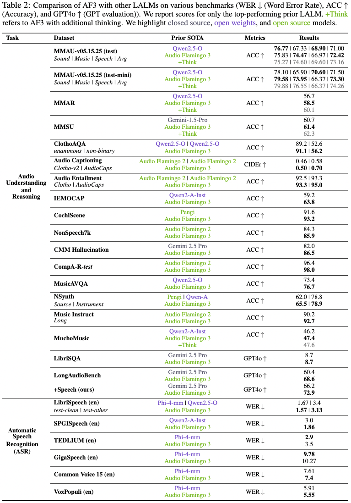

<div align="center" style="display: flex; justify-content: center; align-items: center; text-align: center;">
  <a href="https://github.com/NVIDIA/audio-flamingo" style="margin-right: 20px; text-decoration: none; display: flex; align-items: center;">
    
  </a>
</div>
<div align="center" style="display: flex; justify-content: center; align-items: center; text-align: center;">
    <h2>
    Audio Flamingo 3: Advancing Audio Intelligence with Fully Open Large Audio-Language Models
    </h2>
</div>

<div align="center" style="display: flex; justify-content: center; margin-top: 10px;">
  <a href="https://arxiv.org/abs/2507.08128"></a>
  <a href="https://research.nvidia.com/labs/adlr/AF3/"></a>
  <a href="https://github.com/NVIDIA/audio-flamingo"></a>
  <a href="https://github.com/NVIDIA/audio-flamingo/stargazers"></a>
</div>

<div align="center" style="display: flex; justify-content: center; margin-top: 10px; flex-wrap: wrap; gap: 5px;">
  <a href="https://huggingface.co/nvidia/audio-flamingo-3">
    
  </a>
  <a href="https://huggingface.co/nvidia/audio-flamingo-3-chat">
    
  </a>
  <a href="https://huggingface.co/spaces/nvidia/audio_flamingo_3">
    </a>
</div>
<div align="center" style="display: flex; justify-content: center; margin-top: 10px;">
  <a href="https://huggingface.co/datasets/nvidia/AudioSkills">
    
  </a>
  <a href="https://huggingface.co/datasets/nvidia/LongAudio">
    
  </a>
  <a href="https://huggingface.co/datasets/nvidia/AF-Chat">
    
  </a>
  <a href="https://huggingface.co/datasets/nvidia/AF-Think">
    
  </a>
</div>


## Overview

This repo contains the PyTorch implementation of [Audio Flamingo 3: Advancing Audio Intelligence with Fully Open Large Audio-Language Models](https://arxiv.org/abs/2507.08128). Audio Flamingo 3 (AF3) is a fully open, state-of-the-art Large Audio-Language Model (LALM) that advances reasoning and understanding across speech, sounds, and music. AF3 builds on previous work with innovations in:

- Unified audio representation learning (speech, sound, music)  
- Flexible, on-demand chain-of-thought reasoning (Thinking in Audio) 
- Long-context audio comprehension (including speech and up to 10 minutes)
- Multi-turn, multi-audio conversational dialogue (AF3-Chat)    
- Voice-to-voice interaction (AF3-Chat)    

Extensive evaluations confirm AF3’s effectiveness, setting new benchmarks on over 20 public audio understanding and reasoning tasks.


## Main Results

Audio Flamingo 3 outperforms prior SOTA models including GAMA, Audio Flamingo, Audio Flamingo 2, Qwen-Audio, Qwen2-Audio, Qwen2.5-Omni.LTU, LTU-AS, SALMONN, AudioGPT, Gemini Flash v2 and Gemini Pro v1.5 on a number of understanding and reasoning benchmarks.

<div align="center">
  
</div>

<div align="center">
  
</div>

## Audio Flamingo 3 Architecture

Audio Flamingo 3 uses AF-Whisper unified audio encoder, MLP-based audio adaptor, Decoder-only LLM backbone (Qwen2.5-7B), and Streaming TTS module (AF3-Chat).
Audio Flamingo 3 can take up to 10 minutes of audio inputs. 

<div align="center">
  
</div>

## Installation

```bash
./environment_setup.sh af3
```

## Code Structure

- The folder ```scripts``` contains the training and inference scripts of Audio Flamingo 3. 

Each folder is self-contained and we expect no cross dependencies between these folders. This repo does not contain the code for Streaming-TTS pipeline which will released in the near future.

## Single Line Inference

To infer stage 3 model directly, run the command below:
```bash
python llava/cli/infer_audio.py --model-base nvidia/audio-flamingo-3 --conv-mode auto --text "Please describe the audio in detail" --media static/audio/audio2.wav
```

To infer the model in stage 3.5 model (thinking mode), run the command below:
```bash
python llava/cli/infer_audio.py --model-base nvidia/audio-flamingo-3 --conv-mode auto --text "What are the two people doing in the audio? Please think and reason about the input audio before you respond." --media static/think/audio1.wav --think-mode
```
Add the suffix `Please think and reason about the input audio before you respond.` to the prompt for activating AF3's thinking capabilities.

## Hugging Face Demo

Launch a demo locally using the command below:

```bash
python llava/eval/app.py
```

## Training Details

Scripts for different stages of training are in the `scripts/stagex_af3.sh` folder. Replace the LLM pre-trained checkpoint with `Qwen-2.5-7B-Instruct` or your previoulsy trained `stagex` checkpoint (line 9), paths to data mixture (line 12) and path to the sound tower `AF-Whisper` (line 32) in the respective bash files.
Prepare training json data files in the format below:
```json
[
  {
    "id": "ID1",
    "sound": "Path to the wav file.",
    "duration": "The duration in floating point.",
    "conversations": [
      {
        "from": "human",
        "value": "<sound>
The Question."
      },
      {
        "from": "gpt",
        "value": "The Answer."
      }
    ]
  },
  {
    "id": "ID2",
    "sound": "Path to the wav file.",
    "duration": "The duration in floating point.",
    "conversations": [
      {
        "from": "human",
        "value": "<sound>
The Question."
      },
      {
        "from": "gpt",
        "value": "The Answer."
      }
    ]
  },
  ...
]
```
Add the path to these jsons in `llava/data/datasets_mixture.py.` 

## Evaluation Details

To run evaluation on your target benchamrk, prepare test/val json files in the format above. Add the path to the test jsons in this file `llava/data/registry/datasets/audio_test.yaml`. 

```bash
sh scripts/eval.sh
```
Edit command line arguments to the above script as needed.

## References

The main training and inferencing code within each folder are modified from [NVILA](https://github.com/NVlabs/VILA/tree/main) [Apache license](incl_licenses/License_1.md).

## License

- The code in this repo is under [MIT license](incl_licenses/MIT_license.md).
- The checkpoints are for non-commercial use only [NVIDIA OneWay Noncommercial License](incl_licenses/NVIDIA_OneWay_Noncommercial_License.docx). They are also subject to the [Qwen Research license](https://huggingface.co/Qwen/Qwen2.5-7B/blob/main/LICENSE), the [Terms of Use](https://openai.com/policies/terms-of-use) of the data generated by OpenAI, and the original licenses accompanying each training dataset.
- Notice: Audio Flamingo 3 is built with Qwen-2.5. Qwen is licensed under the Qwen RESEARCH LICENSE AGREEMENT, Copyright (c) Alibaba Cloud. All Rights Reserved.


## Citation

- Audio Flamingo
```
@inproceedings{kong2024audio,
  title={Audio Flamingo: A Novel Audio Language Model with Few-Shot Learning and Dialogue Abilities},
  author={Kong, Zhifeng and Goel, Arushi and Badlani, Rohan and Ping, Wei and Valle, Rafael and Catanzaro, Bryan},
  booktitle={International Conference on Machine Learning},
  pages={25125--25148},
  year={2024},
  organization={PMLR}
}
```

- Audio Flamingo 2
```
@inproceedings{
ghosh2025audio,
  title={Audio Flamingo 2: An Audio-Language Model with Long-Audio Understanding and Expert Reasoning Abilities},
  author={Ghosh, Sreyan and Kong, Zhifeng and Kumar, Sonal and Sakshi, S and Kim, Jaehyeon and Ping, Wei and Valle, Rafael and Manocha, Dinesh and Catanzaro, Bryan},
  booktitle={Forty-second International Conference on Machine Learning},
  year={2025},
  url={https://openreview.net/forum?id=xWu5qpDK6U}
}
```

- Audio Flamingo 3
```
@article{goel2025audio,
  title={Audio Flamingo 3: Advancing Audio Intelligence with Fully Open Large Audio Language Models},
  author={Goel, Arushi and Ghosh, Sreyan and Kim, Jaehyeon and Kumar, Sonal and Kong, Zhifeng and Lee, Sang-gil and Yang, Chao-Han Huck and Duraiswami, Ramani and Manocha, Dinesh and Valle, Rafael and Catanzaro, Bryan},
  journal={arXiv preprint arXiv:2507.08128},
  year={2025}
}
```
