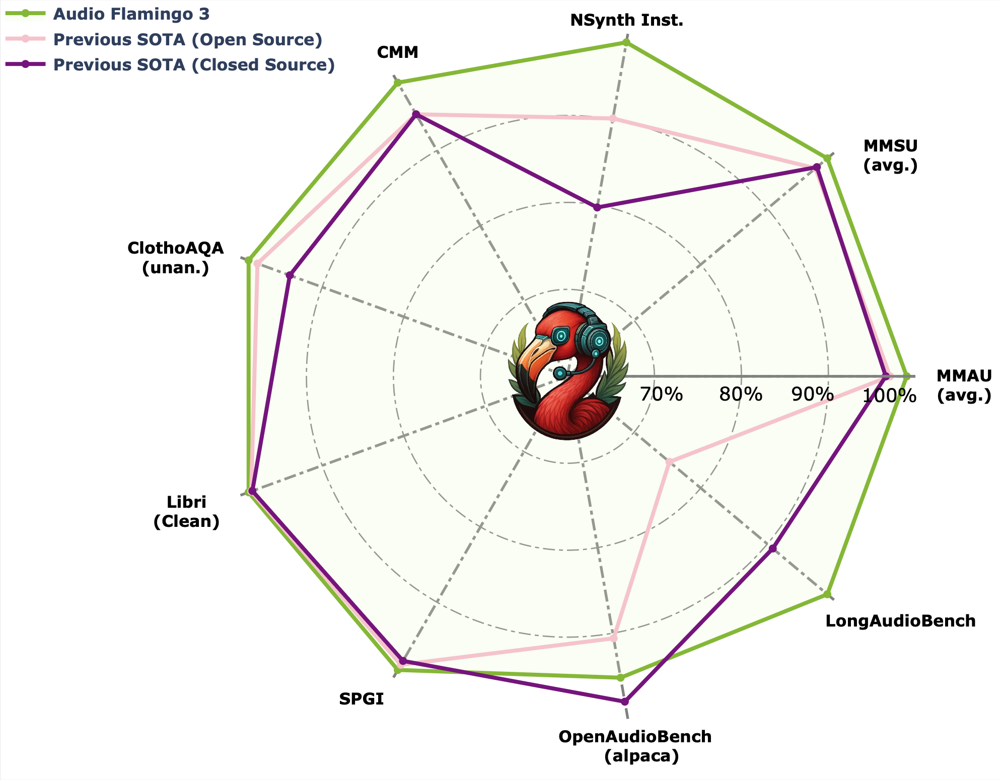
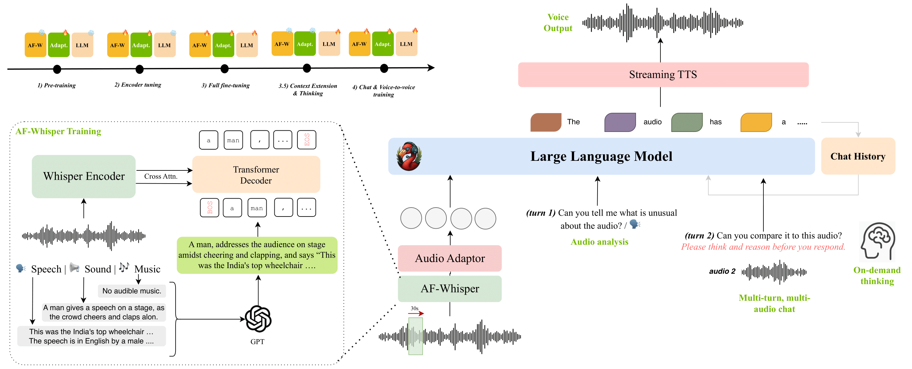

# Model Overview

## Description:
Audio Flamingo 3 (AF3) is a fully open, state-of-the-art Large Audio-Language Model (LALM) that advances reasoning and understanding across speech, sounds, and music. AF3 builds on previous work with innovations in:

- Unified audio representation learning (speech, sound, music)  
- Flexible, on-demand chain-of-thought reasoning  
- Long-context audio comprehension (up to 10 minutes)
- Multi-turn, multi-audio conversational dialogue (AF3-Chat)    
- Voice-to-voice interaction (AF3-Chat)    

Extensive evaluations confirm AF3’s effectiveness, setting new benchmarks on over 20 public audio understanding and reasoning tasks.

**This model is for non-commercial research purposes only.**

 

## License / Terms of Use
The model is released under the [NVIDIA OneWay Noncommercial License](incl_licenses/NVIDIA_OneWay_Noncommercial_License.docx). Portions of the dataset generation are also subject to the [Qwen Research License](https://huggingface.co/Qwen/Qwen2.5-3B/blob/main/LICENSE) and OpenAI’s [Terms of Use](https://openai.com/policies/terms-of-use).

## Deployment Geography
Global.

## Use Case
Intended for researchers and developers to explore:
- Audio question answering and reasoning  
- Long-context audio comprehension  
- Interactive sound/music design assistants  
- Multi-turn (voice) chat    

## Release Date
- Github (07/10/2025) via https://github.com/NVIDIA/audio-flamingo
- HuggingFace (07/10/2025) via https://huggingface.co/nvidia/audio-flamingo

## References:
* [Audio Flamingo 3: Advancing Audio Intelligence with Fully Open Large Audio-Language Models]()  
* [Project Page](https://github.com/NVIDIA/audio-flamingo)  
* [Demo Website](https://research.nvidia.com/labs/adlr/AF3/)
* [Hugging Face](https://huggingface.co/nvidia/audio-flamingo-3)

## Model Architecture:
**Architecture Type:** Transformer   
**Network Architecture:** Audio Flamingo 3  

AF3 uses:
- AF-Whisper unified audio encoder  
- MLP-based audio adaptor  
- Decoder-only LLM backbone (Qwen2.5-7B)  
- Streaming TTS module (AF3-Chat) 

**This model was developed based on [NVILA](https://github.com/NVlabs/VILA/tree/main/scripts/NVILA-Lite) and [Qwen-2.5-7B](https://huggingface.co/Qwen/Qwen2.5-7B)  

## Input: 
Input Type: Audio, Text  
Input Format: WAV/MP3/FLAC, UTF-8 text  
Input Parameters: Audio is Two-Dimensional (2D) and Text is One-Dimensional (1D) 
Other Properties Related to Input:  
-Max Audio Length: 10 Minutes  
-Max Text Length: 16000 tokens 

## Output: 
Output Type: Text (and optional speech)  
Text Format: UTF-8 string   
Output Parameters: One-Dimensional (1D) 
Other Properties Related to Output:  
-Max Text Length: 1024 tokens  
-Speech Format: streaming TTS (text-to-speech) waveform 

Our AI models are designed and/or optimized to run on NVIDIA GPU-accelerated systems (A100/H100). By leveraging NVIDIA’s hardware (e.g. GPU cores) and software frameworks (e.g., CUDA libraries), the model achieves faster training and inference times compared to CPU-only solutions.   

## Software Integration:
**Runtime Engine:** PyTorch / HuggingFace Transformers  

**Supported Hardware:**  
* NVIDIA Ampere (A100)  
* NVIDIA Hopper (H100)  

**Supported OS:**  
* Linux  

## Model Version:
* v3.0  

---

## Training and Testing Datasets:

### Training Dataset:
AF3 is trained entirely on open-source audio data, organized into four novel, large-scale collections. For each dataset, we mention whether the dataset annotations are collected by Human or they are Automated i.e. generated using AI models.

The data collection method noted below applies for all datasets used for training and testing:
Data Collection Method: Human
Labeling Collection Method: Please see below:

#### General Sound:
* [WavCaps](https://github.com/XinhaoMei/WavCaps) (Automated)
* [MACS](https://zenodo.org/records/5114771) (Human)
* [SoundDescs](https://github.com/akoepke/audio-retrieval-benchmark) (Human)
* [Clotho-v2](https://github.com/audio-captioning/clotho-dataset/tree/master) (Human)
* [WavText5K](https://github.com/microsoft/WavText5K) (Human)
* [Clotho-AQA](https://zenodo.org/records/6473207) (Human)
* [Open-AQA](https://github.com/YuanGongND/ltu?tab=readme-ov-file)  (Automated)
* [CompA-R](https://github.com/Sreyan88/GAMA)  (Automated)
* [Salmonn AQA](https://github.com/bytedance/SALMONN/tree/main)  (Automated)
* [Audio Entailment](https://github.com/microsoft/AudioEntailment)(Automated)
* [CompA](https://github.com/Sreyan88/CompA)  (Automated)
* [AudioSet](https://research.google.com/audioset/download.html)  (Human)
* [YouTube-8M](https://research.google.com/youtube8m/)  (Human)
* [FSD50k](https://zenodo.org/records/4060432)  (Human)
* [CochlScene](https://github.com/cochlearai/cochlscene)  (Human)
* [NonSpeech7K](https://zenodo.org/records/6967442)  (Human)
* [Chime-Home](https://code.soundsoftware.ac.uk/projects/chime-home-dataset-annotation-and-baseline-evaluation-code)  (Human)
* [Sonyc-UST](https://zenodo.org/records/3966543)  (Human)

#### Music:
* [LP-MusicCaps](https://github.com/seungheondoh/lp-music-caps)  (Automated)
* [MusicQA](https://github.com/shansongliu/MU-LLaMA?tab=readme-ov-file)  (Automated)
* [MusicAVQA](https://gewu-lab.github.io/MUSIC-AVQA/)  (Human)
* [MusicBench](https://huggingface.co/datasets/amaai-lab/MusicBench)  (Automated)
* [Mu-LLAMA](https://github.com/shansongliu/MU-LLaMA)  (Automated)
* [NSynth](https://magenta.tensorflow.org/datasets/nsynth)  (Human)
* [FMA](https://github.com/mdeff/fma)  (Human)
* [MusDB-HQ](https://zenodo.org/records/3338373)  (Human)
* [Music4All](https://sites.google.com/view/contact4music4all)  (Human)
* [Million Song Dataset](http://millionsongdataset.com/)  (Human)

#### Speech:
* [MSP-Podcast](https://ecs.utdallas.edu/research/researchlabs/msp-lab/MSP-Podcast.html)  (Human)
* [JL-Corpus](https://github.com/tli725/JL-Corpus)  (Human)
* [MELD](https://github.com/declare-lab/MELD)  (Human)
* [Tess](https://www.kaggle.com/datasets/ejlok1/toronto-emotional-speech-set-tess)  (Human)
* [OMGEmotion](https://github.com/knowledgetechnologyuhh/OMGEmotionChallenge)  (Human)
* [Emov-DB](https://github.com/numediart/EmoV-DB)  (Human)
* [LibriSpeech](https://www.openslr.org/12)  (Human)  
* [SPGISpeech](https://datasets.kensho.com/datasets/spgispeech)  (Human)  
* [TEDLIUM](https://www.openslr.org/51/)  (Human)  
* [GigaSpeech](https://github.com/SpeechColab/GigaSpeech)  (Human)  
* [Common Voice 15](https://huggingface.co/datasets/mozilla-foundation/common_voice_12_0)  (Human)  
* [VoxPopuli](https://github.com/facebookresearch/voxpopuli)  (Human)  
* [VoxCeleb2](https://www.robots.ox.ac.uk/~vgg/data/voxceleb/vox2.html)  (Human)  
* [Switchboard](https://catalog.ldc.upenn.edu/LDC97S62)  (Human) 
* [AMI](https://groups.inf.ed.ac.uk/ami/corpus/)  (Human) 

#### Voice:
* [VoiceAssistant-400K](https://huggingface.co/datasets/gpt-omni/VoiceAssistant-400K)  (Automated)

#### Mixed:
* [AudioSkills-XL (ours)](https://huggingface.co/datasets/nvidia/AudioSkills) (Automated)
* [LongAudio-XL (ours)](https://huggingface.co/datasets/nvidia/LongAudio) (Automated)
* [AF-Think (ours)](https://huggingface.co/datasets/nvidia/AF-Think) (Automated)
* [AF-Chat (ours)](https://huggingface.co/datasets/nvidia/AF-Chat) (Automated)

---

### Testing Dataset:
Audio Flamingo 3 is evaluated on the test split of the following datasets.

Data Collection Method: Human (for all datasets noted below)
Labeling Method: See below

* [ClothoAQA](https://zenodo.org/records/6473207)  (Human)
* [MusicAVQA](https://gewu-lab.github.io/MUSIC-AVQA/)  (Human)
* [Clotho-v2](https://github.com/audio-captioning/clotho-dataset/tree/master)  (Human)
* [CochlScene](https://github.com/cochlearai/cochlscene)  (Human)
* [NonSpeech7K](https://zenodo.org/records/6967442)  (Human)
* [NSynth](https://magenta.tensorflow.org/datasets/nsynth)  (Human)
* [AudioCaps](https://github.com/cdjkim/audiocaps)  (Human)
* [US8K](https://urbansounddataset.weebly.com/urbansound8k.html)  (Human)
* [GTZAN](https://www.tensorflow.org/datasets/catalog/gtzan)  (Human)
* [MMAU](https://github.com/Sakshi113/mmau/tree/main)  (Human)
* [MMAR](https://arxiv.org/abs/2505.13032)  (Human)
* [Audio Entailment](https://github.com/microsoft/AudioEntailment)(Automated)
* [CompA-R-test](https://github.com/Sreyan88/GAMA)  (Automated)
* [MuchoMusic](https://huggingface.co/datasets/yongyizang/RUListening)  (Automated)
* [Open-AQA](https://github.com/YuanGongND/ltu?tab=readme-ov-file)(Automated)
* [MusicInstruct](https://huggingface.co/datasets/m-a-p/Music-Instruct)  (Automated)
* [MusicQA](https://huggingface.co/datasets/mu-llama/MusicQA)  (Automated)
* [CMM Hallucination](https://huggingface.co/datasets/DAMO-NLP-SG/CMM)  (Human)  
* [IEMOCAP](https://sail.usc.edu/iemocap/)  (Human)  
* [VoiceBench](https://github.com/MatthewCYM/VoiceBench)  (Human)  
* [OpenAudioBench](https://huggingface.co/datasets/baichuan-inc/OpenAudioBench) (Human)  
* [SEED](https://github.com/BytedanceSpeech/seed-tts-eval)  (Human)  
* [LibriSpeech](https://www.openslr.org/12)  (Human)  
* [SPGISpeech](https://datasets.kensho.com/datasets/spgispeech)  (Human)  
* [TEDLIUM](https://www.openslr.org/51/)  (Human)  
* [GigaSpeech](https://github.com/SpeechColab/GigaSpeech)  (Human)  
* [Common Voice 15](https://huggingface.co/datasets/mozilla-foundation/common_voice_12_0)  (Human)  
* [VoxPopuli](https://github.com/facebookresearch/voxpopuli)  (Human)  
* [LongAudioBench (ours)](https://huggingface.co/datasets/nvidia/LongAudio)  (Automated) 
* [AF-Chat-test (ours)](https://huggingface.co/datasets/nvidia/AF-Chat)  (Human) 

---

## Inference:

**Engine:** HuggingFace Transformers  
**Test Hardware:** NVIDIA A100 80 GB  

---

## Ethical Considerations:
NVIDIA believes Trustworthy AI is a shared responsibility and we have established policies and practices to enable development for a wide array of AI applications.  When downloaded or used in accordance with our terms of service, developers should work with their internal model team to ensure this model meets requirements for the relevant industry and use case and addresses unforeseen product misuse.
Please report security vulnerabilities or NVIDIA AI Concerns [here](https://www.nvidia.com/en-us/support/submit-security-vulnerability/).

---

## Acknowledgements
Built with Qwen, NVILA and the open audio-ML community.  